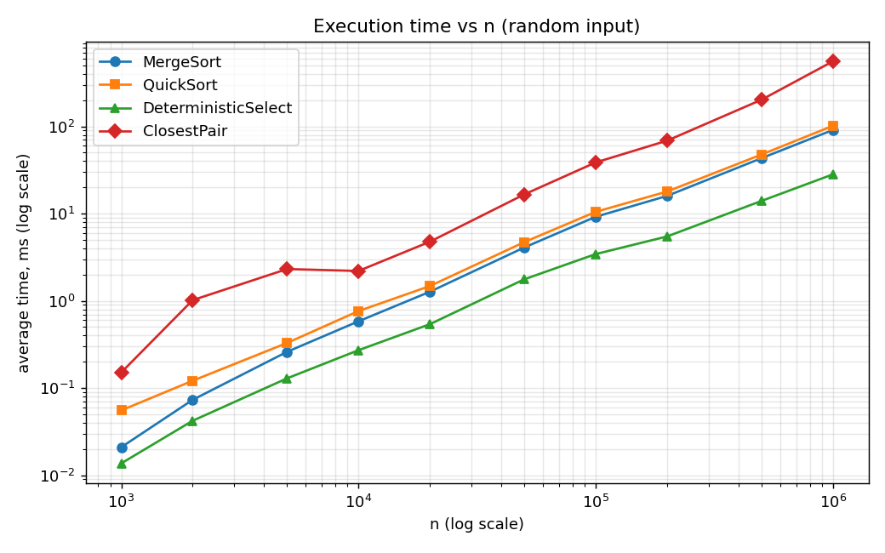
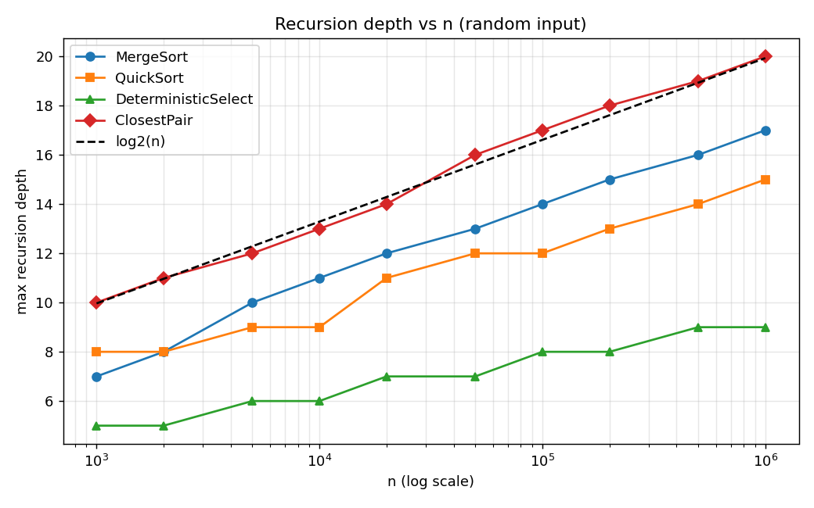
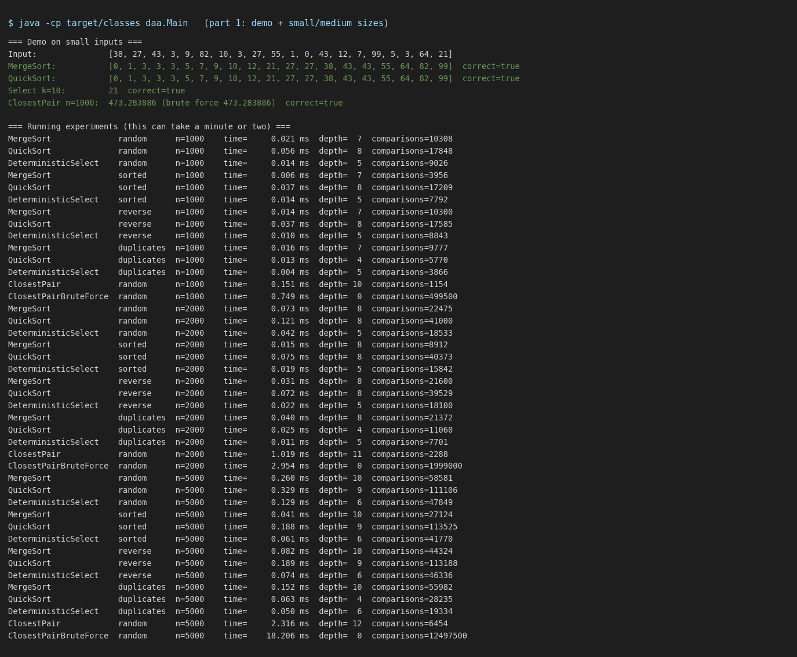
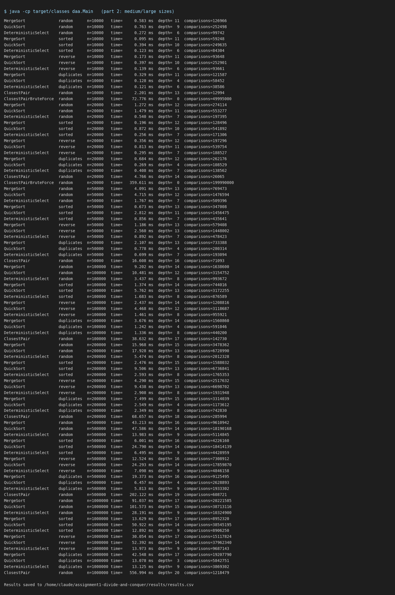
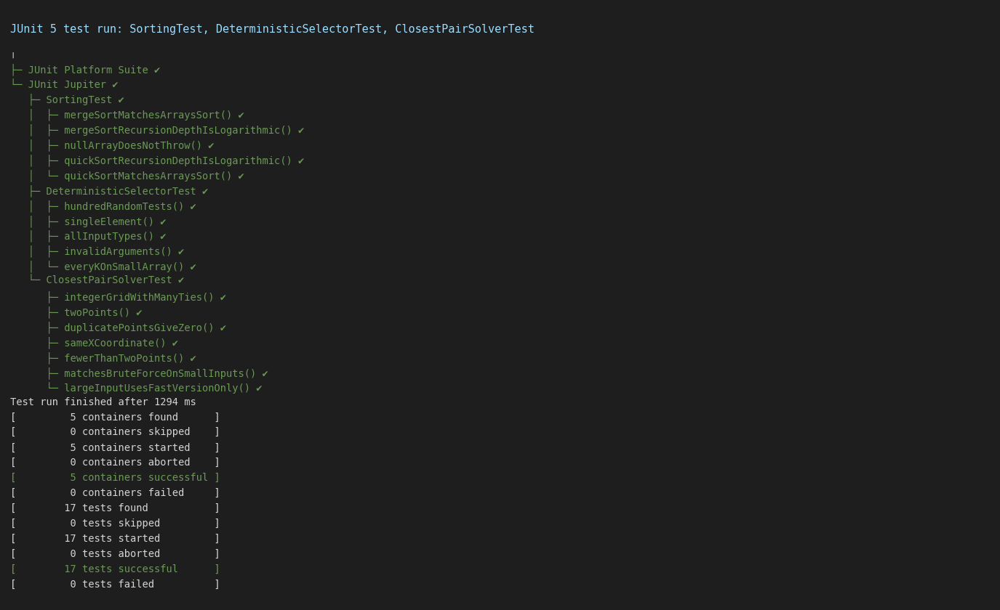
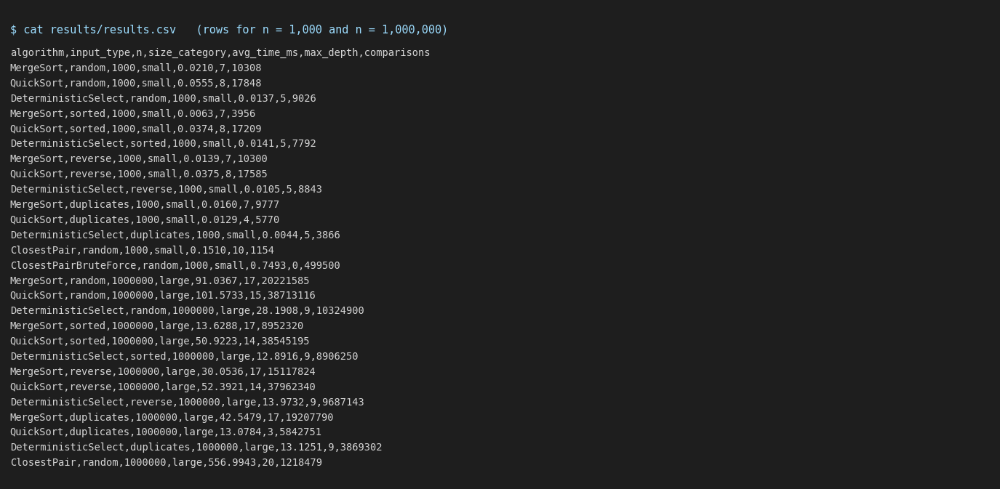
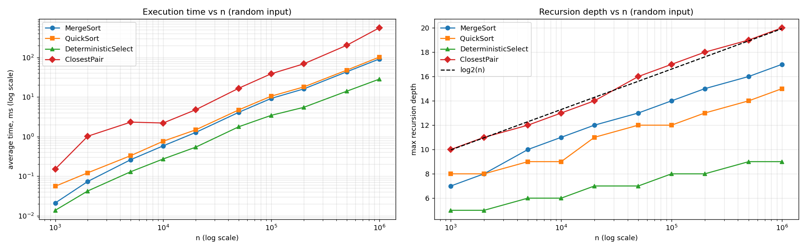

# Assignment 1 — Divide-and-Conquer Algorithm Analysis

## How to run

```bash
mvn test                                  # run JUnit 5 tests
mvn package -DskipTests                   # compile
java -cp target/classes daa.Main          # demo + experiments -> results/results.csv
python docs/plots/plot_results.py         # build plots (needs matplotlib)
```

---

## A. Project Overview

The goal is to implement four divide-and-conquer algorithms, analyse them with recurrences
and compare the theory with real measurements.

Implemented algorithms: **MergeSort**, **randomized QuickSort**, **Deterministic Select (Median-of-Medians)**,
**Closest Pair of Points**.

Measured metrics: execution time (`System.nanoTime()`, average of 7 runs after warm-up),
maximum recursion depth, number of comparisons (additional metric, saved in `results/results.csv`).
Input sizes: 1,000 – 1,000,000. Input types: random, sorted, reverse-sorted, duplicate-heavy.

---

## B. Algorithm Analysis

### MergeSort
Split the array in half, sort both halves recursively, merge them in linear time.
One auxiliary buffer is reused for all merges; parts of size ≤ 16 are sorted with Insertion Sort.

* Recurrence: T(n) = 2T(n/2) + Θ(n). Master Theorem, a = 2, b = 2, f(n) = Θ(n) = Θ(n^(log_b a)) → case 2.
* Time: **Θ(n log n)**. Space: Θ(n) buffer + O(log n) stack.

### QuickSort
Pick a random pivot, partition in place into `< pivot`, `= pivot`, `> pivot`,
recurse into the smaller part and continue with a loop on the larger part.

* Average: T(n) = 2T(n/2) + Θ(n) → **Θ(n log n)**. Even an uneven split like T(n/10) + T(9n/10) + Θ(n)
  gives Θ(n log n) by Akra–Bazzi intuition (1/10 + 9/10 = 1, so p = 1).
* Worst case: T(n) = T(n − 1) + Θ(n) → **O(n²)** (very unlikely with a random pivot).
* Space: O(log n) stack, because the recursive call always gets at most half of the elements.

### Deterministic Select (Median-of-Medians)
Split into groups of 5, take the median of each group, recursively find the median of these medians and use it
as the pivot. Partition in place and continue only in the part that contains the k-th element.

* The pivot has at least ≈ 3n/10 elements on each side, so the remaining part has ≤ 7n/10 elements.
* Recurrence: T(n) ≤ T(n/5) + T(7n/10) + Θ(n). Master Theorem does not apply directly; by Akra–Bazzi intuition
  1/5 + 7/10 = 0.9 < 1, so the Θ(n) term dominates.
* Time: **Θ(n)** in the worst case. Space: O(log n) stack.

### Closest Pair of Points
Sort points by x. Split in the middle, solve both halves, d = min(dLeft, dRight).
Merge the halves by y, take the strip of points with |x − x_mid| < d and compare each point
only with the next points whose y-difference is < d (at most 7 of them).

* Recurrence: T(n) = 2T(n/2) + Θ(n) (merge + strip). Master Theorem case 2.
* Time: **Θ(n log n)** (plus the initial Θ(n log n) sort). Space: Θ(n).

---

## C. Experimental Results

Environment: OpenJDK 21, Linux x86-64. Full data: `results/results.csv`.

### Execution time, ms (random input)

| n | MergeSort | QuickSort | DeterministicSelect | ClosestPair |
|---:|---:|---:|---:|---:|
| 1,000 | 0.021 | 0.056 | 0.014 | 0.151 |
| 2,000 | 0.073 | 0.121 | 0.042 | 1.019 |
| 5,000 | 0.260 | 0.329 | 0.129 | 2.316 |
| 10,000 | 0.583 | 0.763 | 0.272 | 2.201 |
| 20,000 | 1.272 | 1.479 | 0.540 | 4.766 |
| 50,000 | 4.091 | 4.715 | 1.767 | 16.6 |
| 100,000 | 9.202 | 10.5 | 3.437 | 38.6 |
| 200,000 | 16.0 | 17.9 | 5.474 | 68.7 |
| 500,000 | 43.2 | 47.6 | 14.0 | 202.1 |
| 1,000,000 | 91.0 | 101.6 | 28.2 | 557.0 |

### Recursion depth (random input)

| n | log2(n) | MergeSort | QuickSort | DeterministicSelect | ClosestPair |
|---:|---:|---:|---:|---:|---:|
| 1,000 | 10.0 | 7 | 8 | 5 | 10 |
| 2,000 | 11.0 | 8 | 8 | 5 | 11 |
| 5,000 | 12.3 | 10 | 9 | 6 | 12 |
| 10,000 | 13.3 | 11 | 9 | 6 | 13 |
| 20,000 | 14.3 | 12 | 11 | 7 | 14 |
| 50,000 | 15.6 | 13 | 12 | 7 | 16 |
| 100,000 | 16.6 | 14 | 12 | 8 | 17 |
| 200,000 | 17.6 | 15 | 13 | 8 | 18 |
| 500,000 | 18.9 | 16 | 14 | 9 | 19 |
| 1,000,000 | 19.9 | 17 | 15 | 9 | 20 |

### Different input sizes and types: time, ms / max depth

| Size | n | Input type | MergeSort | QuickSort | DeterministicSelect |
|---|---:|---|---:|---:|---:|
| small | 1,000 | random | 0.021 / 7 | 0.056 / 8 | 0.014 / 5 |
| small | 1,000 | sorted | 0.006 / 7 | 0.037 / 8 | 0.014 / 5 |
| small | 1,000 | reverse | 0.014 / 7 | 0.037 / 8 | 0.011 / 5 |
| small | 1,000 | duplicates | 0.016 / 7 | 0.013 / 4 | 0.004 / 5 |
| medium | 20,000 | random | 1.272 / 12 | 1.479 / 11 | 0.540 / 7 |
| medium | 20,000 | sorted | 0.196 / 12 | 0.872 / 10 | 0.256 / 7 |
| medium | 20,000 | reverse | 0.356 / 12 | 0.813 / 11 | 0.295 / 7 |
| medium | 20,000 | duplicates | 0.684 / 12 | 0.269 / 4 | 0.408 / 7 |
| large | 1,000,000 | random | 91.0 / 17 | 101.6 / 15 | 28.2 / 9 |
| large | 1,000,000 | sorted | 13.6 / 17 | 50.9 / 14 | 12.9 / 9 |
| large | 1,000,000 | reverse | 30.1 / 17 | 52.4 / 14 | 14.0 / 9 |
| large | 1,000,000 | duplicates | 42.5 / 17 | 13.1 / 3 | 13.1 / 9 |

### Plots





---

## D. Discussion

**Do the results match theoretical complexity?**
Yes. On random input, the number of comparisons stays ≈ 1.0 · n log2 n for MergeSort, ≈ 1.9 · n log2 n for QuickSort
and ≈ 10 · n for Select for all sizes from 1,000 to 1,000,000 (see `results.csv`), which matches Θ(n log n) and Θ(n).
On the time plot the lines grow almost linearly on the log–log scale. The recursion depth grows like log n.

**How does input structure affect performance?**
MergeSort is fastest on sorted input (13.6 ms vs 91.0 ms on random, n = 1,000,000) because merges stop early and
branches are predictable. QuickSort with a random pivot does not become O(n²) on sorted input. On duplicate-heavy input
the 3-way partition removes all equal elements at once, so QuickSort is much faster (13.1 ms) and its depth is only 3.

**Why does smaller-first recursion help QuickSort?**
The recursive call always gets the smaller part (≤ n/2 elements), so the stack depth is at most log2 n + 1 for any
pivots. The larger part is handled by a loop and uses no extra stack. In the experiments the depth was 15 for
n = 1,000,000.

**Why does Median-of-Medians guarantee O(n)?**
The pivot always removes at least ≈ 30% of the elements. The two recursive sizes add up to 0.9n < n, so the work is a
geometric series n + 0.9n + 0.81n + … ≤ 10n.

**Why is divide-and-conquer Closest Pair faster than O(n²) for large inputs?**
Brute force compares all pairs: ≈ 200 million distance checks for n = 20,000 (≈ 360 ms). The divide-and-conquer
version compares only neighbours in the strip, ≈ 26 thousand checks (≈ 5 ms). The gap grows with n.

**What practical factors affect performance?**
JIT warm-up (first runs are slow, so warm-up runs are excluded), garbage collection pauses, CPU cache
(`int[]` is faster than `Point[]` of objects), branch prediction, and timer noise for very small inputs.

---

## E. Reflection

I learned that asymptotic complexity describes growth, but constants and input structure strongly affect real speed:
Select is linear but has a large constant, and MergeSort and QuickSort behave differently on sorted and
duplicate-heavy data even though both are Θ(n log n). Counting comparisons was the easiest way to check the theory,
because it does not depend on the JVM.

The main challenges were handling duplicates (solved with a 3-way partition), getting the indices right when moving
group medians in Median-of-Medians, and saving the middle x-coordinate in Closest Pair before the halves are reordered
by y. The first time measurements for small n were noisy until I added a JVM warm-up.

---

## F. Screenshots

Program output:




Test results:



Results and plots:



